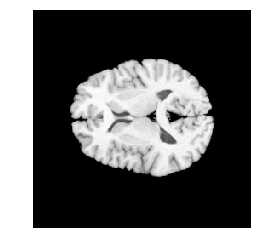

# Using C++ ITK code in Python

The beauty of ANTsPy is the ease at which users can incorporate (i.e. wrap)
their existing C++ code into Python while simultaneously leveraging the
IO, visualization, and greater python inter-operability provided by ANTsPy. 
This short tutorial demonstrates how you can wrap your ITK C++ functions 
in 15 minutes or less.

You'll notice how seemless the wrapping is between C++ and Python due to implicit
casting of standard types by `pybind11` - making the process immensely smoother than
an Rcpp equivalent, for instance.

# Problem Definition

I have a function that takes an ITK image and rescales the intensity. 
I want to use this function in Python, but don't want to go 
about 1) learning a new framework for wrapping my C++ code, 2) learning how 
to build ITK and my python code at the same time, 3) building an entire 
set of IO and plotting tools just for using my function. 

Here is my original code in a file called "rescaleImage.cxx":

```cpp
#include "itkImage.h"
#include "itkScaleTransform.h"
#include "itkResampleImageFilter.h"

template <typename ImageType>
ImageType::Pointer rescaleAntsImage( typename ImageType::Pointer itkImage, float outputMinimum, float outputMaximum )
{
    typedef itk::RescaleIntensityImageFilter< ImageType, ImageType > RescaleFilterType;
    typename RescaleFilterType::Pointer rescaleFilter = RescaleFilterType::New();
    rescaleFilter->SetInput( itkImage );
    rescaleFilter->SetOutputMinimum( outputMinimum );
    rescaleFilter->SetOutputMaximum( outputMaximum );
    
    rescaleFilter->Update();
    return rescaleFilter->GetOutput();
}

```

# Problem Solution

## 1. Functions take py::capsule types as input & output instead of ImageType::Pointer types

The first thing to do is to convert the Input and Output argument types from `ImageType::Pointer` to
`py::capsule`. Py::capsules are containers which hold the underlying ITK smartpointer and let
us pass them around in Python. This needs to be done *ONLY* for input and output types. 

We also need to add in our pybind11 headers which let us implicitly cast between C++

```cpp
#include <pybind11/pybind11.h> // header for wrapping code
#include <pybind11/stl.h> // header for implicitly casting btwn python-cpp types

#include "itkImage.h"
#include "itkScaleTransform.h"
#include "itkResampleImageFilter.h"

namespace py = pybind11;

ttemplate <typename ImageType>
py::capsule rescaleAntsImage( py::capsule & antsImage, float outputMinimum, float outputMaximum )
{
    typedef itk::RescaleIntensityImageFilter< ImageType, ImageType > RescaleFilterType;
    typename RescaleFilterType::Pointer rescaleFilter = RescaleFilterType::New();
    rescaleFilter->SetInput( itkImage );
    rescaleFilter->SetOutputMinimum( outputMinimum );
    rescaleFilter->SetOutputMaximum( outputMaximum );
    
    rescaleFilter->Update();
    return rescaleFilter->GetOutput();
}

```

## 2. Input py::capsule types need to be un-wrapped. Output py::capsule types need to be wrapped.

Now, since we are passing in py::capsule types, we have to add the simple functions for
converting py::capsules to ITK smartpointers and vice-versa. NOTE how we 
add another header `LOCAL_antsImage.h` for doing this.

```cpp
#include <pybind11/pybind11.h>
#include <pybind11/stl.h>

#include "itkImage.h"
#include "itkScaleTransform.h"
#include "itkResampleImageFilter.h"

// NEED THIS INCLUDE FOR WRAPPING/UNWRAPPING
#include "LOCAL_antsImage.h"

namespace py = pybind11;

template <typename ImageType>
py::capsule rescaleAntsImage( py::capsule & antsImage, float outputMinimum, float outputMaximum )
{
    typename ImageType::Pointer itkImage = as< ImageType >( antsImage );

    typedef itk::RescaleIntensityImageFilter< ImageType, ImageType > RescaleFilterType;
    typename RescaleFilterType::Pointer rescaleFilter = RescaleFilterType::New();
    rescaleFilter->SetInput( itkImage );
    rescaleFilter->SetOutputMinimum( outputMinimum );
    rescaleFilter->SetOutputMaximum( outputMaximum );
    
    rescaleFilter->Update();
    return wrap< ImageType >( rescaleFilter->GetOutput() );
}

```

## 3. Functions need to be declared for pybind11

Now, in the file, we need to declare the function for `pybind11` to wrap it in python. 
This is a simple process, but can be tedious since every image type needs to be declared
explicitly. However, this tediousness caused by template usage leads to cleaner code
and better maintainability in the long run.

After declaring your function, your code will look like this (see bottom):

```cpp
#include <pybind11/pybind11.h>
#include <pybind11/stl.h>

#include "itkImage.h"
#include "itkScaleTransform.h"
#include "itkResampleImageFilter.h"

// NEED THIS INCLUDE FOR WRAPPING/UNWRAPPING
#include "LOCAL_antsImage.h"

// NEED THIS FOR PYBIND11
namespace py = pybind11;

template <typename ImageType>
py::capsule rescaleAntsImage( py::capsule & antsImage, float outputMinimum, float outputMaximum )
{
    typename ImageType::Pointer itkImage = as< ImageType >( antsImage );

    typedef itk::RescaleIntensityImageFilter< ImageType, ImageType > RescaleFilterType;
    typename RescaleFilterType::Pointer rescaleFilter = RescaleFilterType::New();
    rescaleFilter->SetInput( itkImage );
    rescaleFilter->SetOutputMinimum( outputMinimum );
    rescaleFilter->SetOutputMaximum( outputMaximum );
    
    rescaleFilter->Update();
    return wrap< ImageType >( rescaleFilter->GetOutput() );
}


// DECLARE OUR FUNCTION FOR APPROPRIATE TYPES 
PYBIND11_MODULE(rescaleImageModule, m)
{
    m.def("rescaleImageF2", &rescaleAntsImage2D<itk::Image<float,2>>);
    m.def("rescaleImageF3", &rescaleAntsImage2D<itk::Image<float,3>>);
}
```

That's all! The wrap declaration process is second nature after a while. Notice how
we named our module `scaleImageModule` - this is what our python module will also be called.

## 4. Functions need to be built in `CMakeLists.txt` and imported in `__init__.py`

Next (almost done), we need to actually build our function during the build process by adding
it to the CMakeLists.txt file in the `antspy/ants/lib/` directory. We only need to add two
lines:

```
pybind11_add_module(rescaleImageModule rescaleImage.cxx)
target_link_libraries(rescaleImageModule PRIVATE ${ITK_LIBRARIES})
```

That's it! The code will now be built when the user runs `python setup.py develop` or
`python setup.py install`. However, we have one last step to make sure it's imported into
the package namespace - we need to import it in the `__init__.py` file found in the
`antspy/ants/lib` directory. Simply add this line:

```python
from .rescaleImageModule import *
```

## 5. Wrapped C++ functions need a Python interface

Now, we have full access to our C++ function in the python/ANTsPY namespace. We can use
this function directly if we want, but for users it's better to have a small python 
interface. This is very easy to implement, and mostly involves argument checking and such.

```python
# relative imports in the package
from .. import utils, core
# could use the following if not in the package:
# from ants import utils, core

def rescale_image(image, min_val, max_val):
    """
    Rescale the intensity of an ANTsImage to be between

    Arguments
    ---------
    image : ANTsImage type
        image to be scaled

    min_val : float
        min value for rescaling

    max_val : float
        max value for rescaling

    Example
    -------
    >>> import ants
    >>> img = ants.image_read(ants.get_data('r16'))
    >>> img_scaled = ants.rescale_image(img, 0.8, 0.8)
    >>> ants.plot(img)
    >>> ants.plot(img_scaled)
    """
    image = image.clone('float')

    # get function from its name
    lib_fn = utils.get_lib_fn('rescaleAntsImage%s' % (image._libsuffix))

    # apply the function to my image
    # remember this function returns a py::capsule
    rescaled_img_ptr = lib_fn(image.pointer, scale1, scale2)

    # wrap the py::capsule back in ANTsImage class
    rescaled_img = core.ANTsImage(pixeltype=image.pixeltype,
                                  dimension=image.dimension,
                                  components=image.components,
                                  pointer=scaled_img_ptr)
    return rescaled_img
```

We also need to import this function in the ANTsPy namespace. If we put the above
python code in a file called `rescale_image.py` in the `antspy/ants/utils` directory, 
then we would add the following line to the `__init__.py` file in the 
`antspy/ants/utils` directory:

```python
from .rescale_image import *
```

Finally, we rebuild the package by going to the main directory and running setup.py again:
```
python setup.py develop
```

Now we can use this function quite easily:

```python
import ants
img = ants.image_read(ants.get_data('r16'))
rescaled_img = ants.rescale_image(img, 0, 1) # rescale between 0 and 1
```




------------------------------------------------------------

And that's it - a painless 15 minute process that gives you access to all of the ANTsPy functionality
such as IO, visualization, numpy-conversion, etc.


